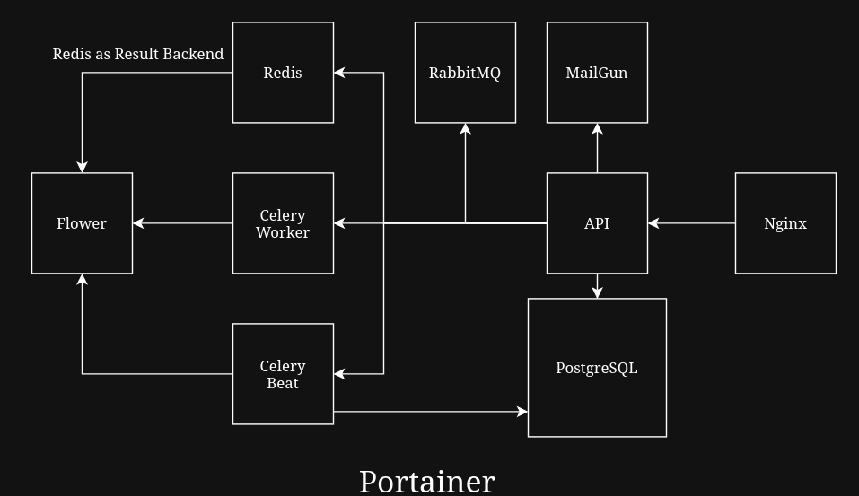
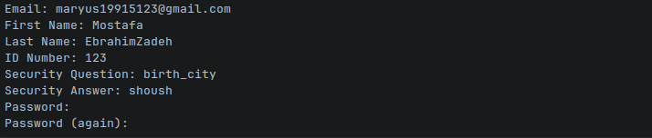

# 🏦 Digital Banking Platform
Modern banking platform built with :


<br>

  
This project provides a sample backend for a digital banking platform with user authentication, KYC profiles, multi-currency bank accounts, transactions, virtual cards, and role-based access control.

### Database Schema :


<br>

### Service Schema :


## 🏗 Architecture
 
| Service       | Port  | Description                     |
|---------------|-------|---------------------------------|
| Nginx (API)   | 8080  | Main API endpoint               |
| PostgreSQL    | 5432  | Database                        |
| Mailpit UI    | 8025  | Local email testing             |
| Flower        | 5555  | Celery monitoring               |
| RabbitMQ      | 15672 | RabbitMQ management             |
 
```
                 Client
                    |
                  Nginx
                    |
            Django REST API
             /      |       \
      PostgreSQL   Redis   RabbitMQ
                              |
                           Celery Worker
                              |
                        Background Jobs
```
 

---

## ✨ Features

### Authentication & Security
- Custom User model (email-based login)
- Role-based access control (Customer, Teller, Account Executive, Branch Manager)
- OTP verification
- Security questions
- Account lockout after failed login attempts
- JWT authentication via Djoser

### User Profile & KYC
- Comprehensive user profile
- Identity documents (photo, ID photo, signature)
- Next of Kin management
- Employment and personal information

### Bank Accounts
- Multiple account types: **Current** & **Saving**
- Multi-currency support: **Toman**, **US Dollar**, **Euro**
- Primary account designation
- KYC verification workflow
- Daily interest calculation for savings accounts

### Transactions
- Deposit
- Withdrawal
- Transfer (with Security Question + OTP verification)
- Interest transactions
- Transaction history with filtering & pagination
- PDF statement generation (sent via email)

### Virtual Cards
- Create and manage virtual cards linked to bank accounts
- Card status management (Active / Inactive / Blocked)

### Infrastructure
- Docker & Docker Compose ready
- PostgreSQL
- Redis + Celery + Celery Beat + Flower
- RabbitMQ
- Nginx reverse proxy
- Mailpit (local email testing)
- API documentation with **drf-spectacular** (Swagger / ReDoc)

---
 
## 🛠 Tech Stack
```

| Category          | Technology                          |
|-------------------|-------------------------------------|
| Framework         | Django + Django REST Framework      |
| Authentication    | Djoser + JWT                        |
| Database          | PostgreSQL                          |
| Task Queue        | Celery + Redis + RabbitMQ           |
| API Docs          | drf-spectacular                     |
| Containerization  | Docker + Docker Compose             |
| Reverse Proxy     | Nginx                               |
| Email (Local)     | Mailpit                             |
```
---
## 🚀 Installation

<p>
This project is simple to run in local, I have created a Makefile for shorten the commands.
</p>
<p>
So You need to install the lastest version of <a href="https://docs.docker.com/engine/install/">Docker</a>
</p><p>
And after the installation of Docker just run the following command :
</p>

```bash
git clone https://github.com/maryus1991/BankingSystem.git
```
```bash
cd BankingSystem/api
```
```bash
make build
```

<p>
And open the <a href="localhost:8080/">localhost:8080/</a> for swagger documentation 
</p>
<p>
And for admin page just run the following to create superuser and enter the admin panel 
</p>

```bash
make superuser
```
some kind fo information for create admin user :




<p>
admin panel path : <a href="localhost:8080/admin/">localhost:8080/admin/</a>  
</p>

 
### Useful Make Commands

| Command                         | Description                  |
|---------------------------------|------------------------------|
| `make build <container name>`   | Build and start all services |
| `make up <container name>`      | Start services               |
| `make ps <container name>`      | Start services               |
| `make down <container name>`    | Stop services                |
| `make down-v <container name>`  | Stop and remove volumes      |
| `make restart <container name>` | Restart the container        |
| `make logs-f <container name>`  | Follow logs                  |
| `make migrate `                 | Run database migrations      |
| `make makemigrations`           | Create new migrations        |
| `make superuser`                | Create a superuser           |
| `make sh <container name>`      | Open shell in a container    |
| `make flush`                    | Flush the database           |

**container name can be provided or be empty**
#### For more command read the makefile
### Production deployment configuration is available through `production.yml`


---
## 📂 Project Structure

```
BankingSystem/
├── api/
│   ├── core_apps/
│   │   ├── accounts/          # Bank accounts & transactions
│   │   ├── cards/             # Virtual cards
│   │   ├── user_auth/         # Custom authentication
│   │   ├── user_profile/      # KYC & profile management
│   │   └── common/            # Shared models & utilities
│   ├── config/                # Django settings
│   ├── docker/                # Dockerfiles
│   ├── requirements/          # Dependencies
│   ├── local.yml              # Local Docker Compose
│   ├── production.yml         # Production Docker Compose
│   └── Makefile               # Useful commands
├── docs/
│   └── DBSchema/              # Database schema diagrams
└── LICENSE
```


## 📡 API Documentation
After starting the project, you can access the interactive API documentation at:

- **Swagger UI**: `http://localhost:8080/api/docs/`
- **ReDoc**: `http://localhost:8080/api/redoc/`

## 🔐 Security

Implemented security mechanisms:

- JWT authentication
- OTP verification
- Account lockout protection
- Role-based permissions
- Secure transaction verification
- KYC workflow

## 🚀 Production Deployment

Production stack:

- Nginx
- Gunicorn
- PostgreSQL
- Redis
- Celery Workers
- RabbitMQ
- Docker Compose
## 🌟 Highlights

- Designed a modular banking backend architecture
- Implemented multi-currency accounts
- Built asynchronous transaction processing
- Designed role-based banking permissions
- Containerized full development environment
## License

This project is licensed under the **BSD 3-Clause License**.  
See the [LICENSE](LICENSE) file for details.

## 👨‍💻 Author
**Mostafa EbrahimZadeh** ([@maryus1991](https://github.com/maryus1991))
